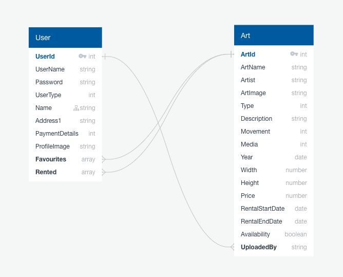

# RentArt(General Assembly SEI Project 3)

[RentArt]: https://rent-art-3352c73c7de6.herokuapp.com/
[githubrepo]: https://github.com/Nemomain/rentart

## Timeframe
7 days, worked as a team of 3 including: Adam Rafferty, Anne-Laure Guillot and myself.

## Technologies used
* React / JavaScript
* React Router DOM
* HTML5
* SASS
* React Bootstrap
* MUI
* Git
* GitHub
* Axios
* Express.js
* Mongoose
* MongoDB
* Vite
* JSON
* Bcrypt
* JWT
* Bearer Tokens
* npm
* Dotenv
* Cloudinary
* Heroku
* Mern Stack

## [Rentart][RentArt] - Fullstack App
## [Rentart Repository][githubrepo] - Application Repository

<!-- links where to find -->

## Project Description
This is a mock platform for renting Art pieces. The idea was not making a realistic service, but working on realistic problems and development that the industry deals with regularly, to showcase we can indeed be useful in any team going forward. Needless to say on the team there was also a love for art, so we had much fun both because we were coding and what we were coding. The platform uses a MERN stack to handle a variety of functionalities including, registering as a user, favoriting artwork, renting the artwork, cancelling a rental, browsing for art and filtering, uploading art if the user is an artist, changing the user information/profile pic etc..

## Project briefing
The brief we were handed specified the following:

```
#  Project #3: A MERN Stack App
​
## Overview
​
**You’ve come a long way, and it's time to show it.** This will be your most advanced project to date. It is __IMPORTANT__ to note that when we say _advanced_, the project doesn't necessarily need to have lots more functionality.
​
**Remember:** simple code is stable code, so always favour refactoring and bug fixing over adding more functionality.
​
With this in mind, you need to be smart about how you plan, limit your project scope to be achievable (in terms of functionality) and focus on quality rather than quantity.
​
Make sure you review your project proposal with your instructor so you can make sure it's **something you can accomplish in the limited time we have**.
​
---
​
## Technical Requirements
​
You must:
​
* **Build a full-stack application** by making your own backend and your own front-end
* **Use an Express API** to serve your data from a Mongo database
* **Consume your API with a separate front-end** built with React
* **Be a complete product** which most likely means multiple relationships and CRUD functionality for at least a couple of models
* **Implement thoughtful user stories/wireframes** that are significant enough to help you know which features are core MVP and which you can cut
* **Have a visually impressive design** to kick your portfolio up a notch and have something to wow future clients & employers. **ALLOW** time for this.
* **Be deployed online** so it's publicly accessible.
​
---
​
## Necessary Deliverables
​
* A **working app** hosted on the internet
* A **link to your hosted working app** in the URL section of your Github repo
* A **git repository hosted on Github**, with a link to your hosted project, and frequent commits dating back to the _very beginning_ of the project
* **A `readme.md` file** with:
    * An embedded screenshot of the app
    * Explanations of the **technologies** used
    * A couple paragraphs about the **general approach you took**
    * **Installation instructions** for any dependencies
    * Link to your **user stories/wireframes** – sketches of major views / interfaces in your application
    * Link to your **pitch deck/presentation** – documentation of your wireframes, user stories, and proposed architecture
    * Descriptions of any **unsolved problems** or **major hurdles** you had to overcome
​
---
​
## Suggested Ways to Get Started
​
* **Don’t get too caught up in too many awesome features** – simple is always better. Build something impressive that does one thing well.
* **Design first.** Planning with user stories & wireframes before writing code means you won't get distracted changing your mind – you'll know what to build, and you can spend your time wisely by just building it.
* **Don’t hesitate to write throwaway code** to solve short term problems.
* **Read the docs for whatever technologies / frameworks / API’s you use**.
* **Write your code DRY** and **build your APIs RESTful**.
* **Be consistent with your code style.** You're working in teams, but you're only making one app per team. Make sure it looks like a unified effort.
* **Commit early, commit often.** Don’t be afraid to break something because you can always go back in time to a previous version.
* **Keep user stories small and well-defined**, and remember – user stories focus on what a user needs, not what development tasks need accomplishing.
* **Write code another developer wouldn't have to ask you about**. Do your naming conventions make sense? Would another developer be able to look at your app and understand what everything is?
* **Make it all well-formatted.** Are you indenting, consistently? Can we find the start and end of every div, curly brace, etc?
* **Comment your code.** Will someone understand what is going on in each block or function? Even if it's obvious, explaining the what & why means someone else can pick it up and get it.
* **Write pseudocode before you write actual code.** Thinking through the logic of something helps.
​
---
## Sign Off Requirments
​
* **A Simple Wireframe** of the front end of the application, this should take into account the user flow through the app, eg, what can logged in users see/not see.
* **A plan for what models/resources** that is needed for the back end application and what the relationships between these will be
```

## Project Planning
We provided a basic wireframe of the App:


Along with a database design:



## Coding/Building Process
Once we got the go ahead we divided the work, with me being in charge of the backend as a whole. The backend started very simple with a couple of endpoints; just to get the Frontend be able to load some images and be able to log in as a user. Eventually though the Backend grew to what it is at the moment. All the back end is still coded by myself. While I was coding that, my teammates were coding the homepage carousel and the gallery respectively. Once the backend was ready to receive basic requests I coded the user register component, the login component and the profile router (It renders a different profile page depending on the type of user).

Profile routing component:
```javascript
import { useNavigate, useOutletContext } from "react-router-dom"
import { useEffect } from "react"

import ArtistProfile from "./ArtistProfile"
import AppreciatorProfile from "./AppreciatorProfile"
import AdminProfile from "./AdminProfile"

export default function Profile(){
  // State
  const data = useOutletContext()
  const [ userData, setUserData ] = data

  // User type variable to render appropriate component
  const type = userData.usertype
  // console.log(type)
  // navigation
  const navigate = useNavigate()

  useEffect(() => {
    function getOut(){
      if (!userData.username){
        navigate("/")
      }
    }
    getOut()
  }, [])

  return (
    <>
      {type === (null || undefined)
      ? navigate('/')
      : type === 1 ? <ArtistProfile userData={userData} />
      : type === 2 ? <AppreciatorProfile userData={userData} setUserData={setUserData} />
      : type === 0 && <AdminProfile userData={userData} />
      }
    </>
  )
}
```

Around this time I also insisted on using React-Router-Dom so we could have a neat and organised place to look at our Frontend endpoints and manage them more effectively. I had some experience with it from my previous project in the bootcamp but my teammates didn't, and after a quick explanation they adapted very easily.
 
Routing with React-Router-Dom:

```javascript
const router = createBrowserRouter([
  {
    path: '/',
    element: <App />,
    children: [
      {
        index: true,
        element: <ArtCarousel />
      },
      {
        path: '/login',
        element: <Login />
      },
      {
        path: '/register',
        element: <RegisterUser />,
      },{
        path: '/about',
        element: <About />,
      },
      {
        path: '/gallery',
        element: <ArtIndex />,
      },
      {
        path: '/collection',
        element: <ArtworkUploadSection />,
      },
      {
        path: '/art/:artId',
        element: <IndArtPage />,
        loader: async ({ params }) => getIndArt(params.artId)
      },
      {
        path: '/profile/:userId',
        element: <IndUserPage />,
        loader: async ({ params }) => getIndUser(params.userId)
      },
      {
        path: '/profile',
        element: <Profile />,
      }
    ]
  }
])

ReactDOM.createRoot(document.getElementById('root')).render(
  <RouterProvider router={router} />
)
```

Because I was coding the registration, the login, the profile router and 3 profiles it also felt natural that I coded how the sessions worked. The sessions ended up being a huge challenge and I started them from scratch many times, and every time I seemed to have fixed a issue a new one popped up. In the end one of the teachers in the bootcamp came to give me a help with that and with some subtle but crucial changes they finally worked as intended.

The sessions ended up using a mix of sessionStorage, userState(), and React-Router-Dom context (because the outlet component doesen't directly take props, and have to use context instead):

```javascript
import { Outlet, useNavigation } from 'react-router-dom'

// components
import Nav from './components/Nav'
import Footer from './components/Footer'

import { Spinner } from 'react-bootstrap'
import { useEffect, useState } from 'react'

export default function App() {
  let stage = sessionStorage.getItem('data')
  const [userData, setUserData] = useState(stage ? JSON.parse(stage) : '')
  const navigation = useNavigation()

  useEffect(() => {
    sessionStorage.setItem('data', JSON.stringify(userData))
  }, [userData])

  return (
    <>
      <Nav userData={userData} setUserData={setUserData}/>
      <main>
      {
      navigation.state === 'idle' ?
      <Outlet context={[userData, setUserData]} />
      :
      <div className='centered'>
        <Spinner animation='border' />
      </div>
      }
      </main>
      <Footer />
    </>
  )
}
```

Also, because I had dedicated so much effort to the session management the 3 distinct profile pages at that point technically existed, but barely a step above placeholders. I made sure that they were pulling the necessary data from the databese and left syling for later. Once that was ready, I jumped to help my teammates with whatever issue they might be having, by doing this not only I felt that I was pulling my weight as a team player, but we sped up development by turning most problems into speedbumps. I was not completely responsible but had a hand in the favoriting system, the individual art page, public profile, and lesser impact was also had throughout the project. I completely coded the admin search tool(in his profile page) and coded the backend for managing rentals from users, then helped a teammate to code the frontend for that same fuctionality. This is a piece of code I am particularly proud of as it changes 3 fields in 2 different MongoDB collections by sending a single boolean, and also manages errors in what I believe is thought of good practice in the industry.

```javascript
export const rentArt = async (req, res) => {
  // mongoose session
  const session = await mongoose.startSession()
  session.startTransaction()
  try {
    const { artId } = req.params
    const art = await Art.findById(artId)
    if (!art) throw new Error('Art not found')
    if (Object.keys(req.body).length === 1 && Object.keys(req.body)[0] === 'availability'){
      // set end of rental date
      if (req.body.availability === true) {
        // If art becomes available again
        const user = await User.findOne({ rented: { $in: [artId] } })
        if (user) {
          user.rented = user.rented.filter(id => id.toString() !== artId)
          Object.assign(art, req.body)
          await user.save()
        }
        await art.save()
        await session.commitTransaction()
        session.endSession()
        return res.json([art, user])
      } else {
        // if art is being rented
        const user = await User.findById(req.currentUser._id)
        if (user.rented.length > 2) throw new Error('Max 2 rentals at a time')
        user.rented.push(artId)
        const inAWeek = new Date()
        inAWeek.setDate(inAWeek.getDate() + 7)
        Object.assign(art, req.body, { rentalStartDate: new Date(), rentalEndDate: inAWeek })
        await user.save()
        await art.save()
        await session.commitTransaction()
        session.endSession()
        return res.json([art, user])
      }
    } else {
      // If something not specified goes wrong
      await session.abortTransaction()
      session.endSession()
      return res.status(404).json({ message: 'Unable to process rent' })
    }
  } catch (error) {
    await session.abortTransaction()
    session.endSession()
    return res.status(400).json({ message: error.message })
  }
}
```

 After that the most crucial part of functionality had already been dealt with, so we focused on managing styling, responsiveness and extra functionality such as uses being able to edit their data etc...

## Wins and Challenges(TLDR)
To be honest, the fact that this project is a miniature version of both social media and online store, and that we managed to include so many little extras in the little time we had is a huge win.

As for challenges personally the greatest challenge was the session persistence management. It was a huge learning occasion and I realised the solution was so simple once done, and that maybe I could have arrived by myself if I hadn't been so unwilling to stop smashing my head into the proverbial wall.

## Bugs
There was also a bug which would inconsistently make an API call return a status 304 and fail to load an asset and I almost lost my mind with that one. In the end the reason for it was a missing '/' in the endpoint on the axios call, but the root cause and the why of the inconsistent behavior is still a mystery. I doubted if to include this in the Challeges sections but I feel this is a much more appropriate place.

As always, there were many other minor bugs, but were not that hard to deal with.

## Future Improvements/Other considerations
If I continue to work on this, I will probably add a following / friending system and a messaging system between users. I also have the idea of giving the admin extra privileges to ban people to snoop on the conversations and other fun stuff like that.
